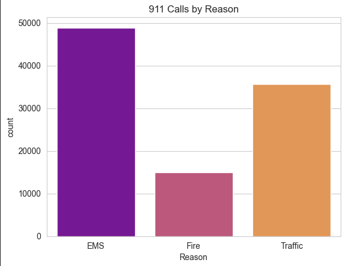
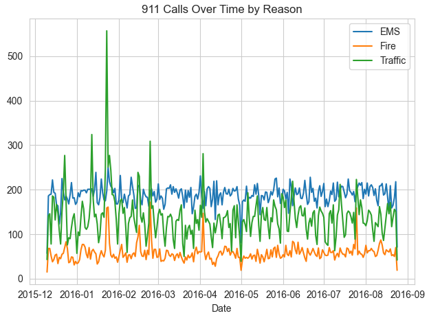
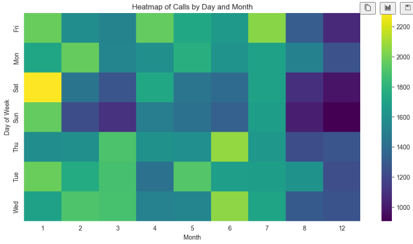
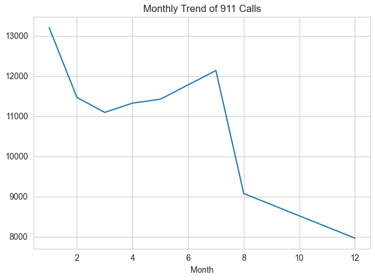

# 911 Calls Data Analysis

## Project Description
This project analyzes 911 emergency call data to uncover trends and patterns, such as the most common reasons for calls and how these vary by time, day, and month. The analysis includes visualizations created using Python libraries like Pandas, Seaborn, and Matplotlib. The goal is to demonstrate fundamental data analysis skills.

## Dataset
The dataset used in this project is the 911 Emergency Calls Dataset, available on Kaggle:  
[911 Emergency Calls Dataset](https://www.kaggle.com/mchirico/montcoalert).

### Note:
This project used a cleaned version of the dataset provided as part of a course exercise. The original dataset can be downloaded from the Kaggle link above.
### Learning Experience:
This project was inspired by a course assignment, but I refactored the code into modular functions, enhanced the visualizations, and added detailed documentation to reflect my understanding.

## Tools and Libraries
- Python
- Pandas
- NumPy
- Matplotlib
- Seaborn

## Key Features
- Data Cleaning:
  - Feature engineering for columns such as `Reason`, `Hour`, `Month`, `Day of Week`, and `Date`.
- Exploratory Data Analysis:
  - Heatmaps and clustermaps for visualizing call distributions.
  - Line plots to show trends over time.
- Insights into 911 call patterns, such as the most common reasons for calls and their time-based distributions.

## How to Use
1. Clone this repository:
   ```bash
   git clone https://github.com/sergey-swift/911-calls-analysis.git
   ```
2. Download the dataset from Kaggle: 911 Emergency Calls Dataset.
3. Save the dataset as `911.csv` in your working directory.
4. Run the script:
   ```bash
   python analysis.py
   ```
5. Follow the prompts to enter the path to the dataset file.

## Results
### Visualizations
Below are some visualizations generated during the analysis:

#### 911 Calls by Reason


#### Calls Over Time by Reason


#### Heatmap of Calls by Day and Month


#### Monthly Trend of 911 Calls


## Acknowledgments
- Dataset: [911 Emergency Calls Dataset](https://www.kaggle.com/mchirico/montcoalert).
- This project was inspired by exercises in a Python for Data Science and Machine Learning Bootcamp by Jose Portilla, Perian Training (Udemy).

## Author
Sergey Swift  
[GitHub Profile](https://github.com/sergey-swift)
